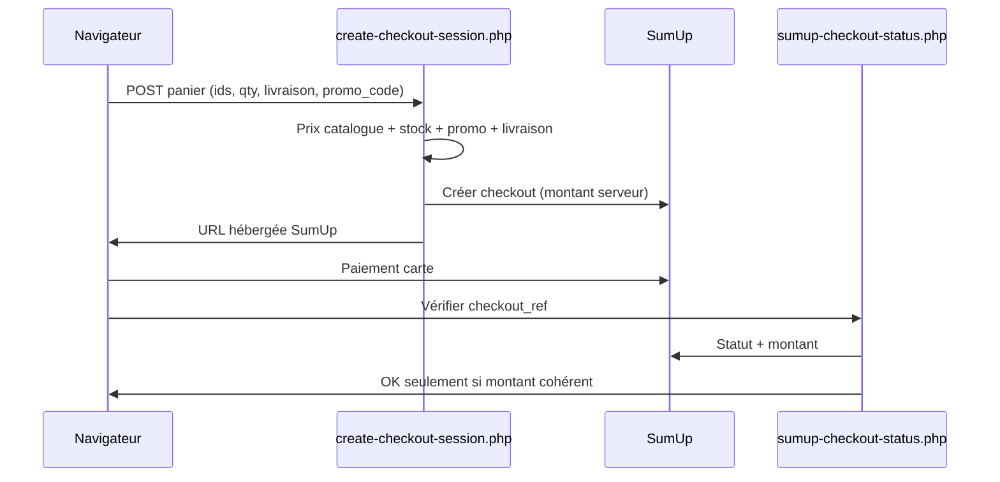

# Renforcements sécurité — guide pour l’entreprise et les clients

Ce document explique **ce qui a été renforcé**, **pourquoi**, et **comment ça fonctionne** dans le code. Il complète `SECURITY.md` (politique générale).

Dernière mise à jour : mai 2026.

---

## 1. Résumé en une phrase

Le site ne fait plus confiance au navigateur pour le **prix**, le **stock détaillé** ni les **erreurs SumUp** : le serveur recalcule tout, limite les abus, et n’expose au public que le strict nécessaire.

---

## 2. Paiement SumUp (protection client + entreprise)

### Problème avant

Un visiteur pouvait, via les outils développeur :

- modifier les prix ou quantités dans le panier ;
- tenter de payer moins que le total affiché ;
- lire des messages d’erreur techniques (clés API, détails curl).

### Ce qui est en place maintenant

| Mesure | Fichier | Comment |
|--------|---------|--------|
| **Catalogue et prix côté serveur** | `data/sumup-config.php` (`SUCRIER_CHECKOUT_CATALOG`) | Seuls les IDs connus et les `unit_amount` en centimes du serveur comptent. Le prix affiché dans `localStorage` est ignoré au paiement. |
| **Contrôle du stock à la commande** | `api/create-checkout-session.php` + `includes/catalog-products.php` | Avant d’ouvrir SumUp, `sucrier_catalog_product_available_for_qty()` vérifie que chaque ligne est encore disponible (données `data/contenu.json`). |
| **Livraison recalculée** | `sucrier_compute_shipping_cents()` dans `create-checkout-session.php` | Poids issus du catalogue serveur, pas du client. |
| **Codes promo appliqués au serveur** | `includes/promo-codes.php` + `promo_codes` dans `contenu.json` | Aucun code par défaut. Seuls les codes **actifs** créés dans le back-office fonctionnent. La remise est déduite **avant** SumUp. |
| **Session de paiement liée** | `$_SESSION['sumup_pending']` | Chaque commande a une référence, un `checkout_id` SumUp et un `amount_cents` attendu stockés côté serveur. |
| **Vérification après paiement** | `api/sumup-checkout-status.php` | Quand SumUp indique « payé », le serveur compare le montant payé au `amount_cents` en session (tolérance 2 centimes). Sinon : refus + trace dans les logs. |
| **Anti-abus checkout** | `sucrier_throttle_consume('checkout_create', 12, 600)` | Max ~12 créations de paiement / 10 min par session. |
| **Origine de la requête** | `sucrier_check_request_origin()` | Les APIs de paiement refusent les requêtes sans `Origin`/`Referer` correspondant à `SUCRIER_ALLOWED_ORIGINS`. |
| **Erreurs génériques** | `sucrier_json_safe_error()` | Le client voit « Impossible d’ouvrir le paiement… » ; les détails SumUp/curl vont dans `error_log` uniquement. |

### Parcours client (simplifié)

### À faire en production (hors code)

- Renseigner `.env` : `SUCRIER_SUMUP_API_KEY`, `SUCRIER_SUMUP_MERCHANT_CODE`, `SUCRIER_BASE_URL`, `SUCRIER_ALLOWED_ORIGINS`.
- HTTPS obligatoire (voir `SECURITY.md`).
- Optionnel : Cloudflare / WAF devant le domaine.

---

## 3. Données catalogue exposées au public

### Problème avant

L’API `api/content.php` renvoyait `catalog_stock` avec **quantités exactes** par produit (visible dans l’inspecteur).

### Ce qui est en place maintenant

| Élément | Fichier | Effet |
|---------|---------|-------|
| Filtre public | `includes/content-public.php` | Retire `catalog_stock` ; ajoute `products_out_of_stock` (liste d’IDs en rupture **sans** quantité). |
| Front aligné | `app.js` → `applyCatalogStockFromContent()` | Utilise uniquement `products_out_of_stock` : affichage « En stock » ou « Rupture », sans « 3 exemplaires restants ». |
| Fichier brut protégé | `data/.htaccess` | `Deny from all` sur `data/` (Apache) — `contenu.json` non téléchargeable directement. |

Le back-office continue de gérer les quantités dans `contenu.json` ; seul le public voit rupture oui/non.

---

## 4. Limitation de débit (anti-spam / brute force)

| Zone | Bucket session | Limite (indicatif) | Fichier |
|------|----------------|-------------------|---------|
| Connexion admin | `admin_login` | 5–8 tentatives / 10 min | `sucrier_throttle_login_attempts()` |
| Formulaire contact | `contact_send` | 5 / 5 min | `api/contact-send.php` (corrigé : plus de partage avec le login admin) |
| Création paiement | `checkout_create` | 12 / 10 min | `api/create-checkout-session.php` |
| Statut paiement | `checkout_status` | 40 / 10 min | `api/sumup-checkout-status.php` |

Implémentation : `includes/security.php` (`sucrier_throttle_request`, `sucrier_throttle_consume`).

---

## 5. APIs sensibles — origine et messages

Les requêtes **POST JSON** importantes passent par `sucrier_check_request_origin()` :

- `create-checkout-session.php`
- `sumup-checkout-status.php`
- `contact-send.php`
- (déjà) auth, changement de langue, etc. — voir `SECURITY.md`

Sans en-tête `Origin` ou `Referer` valide, la requête est refusée (403). Cela complète les cookies `SameSite=Strict`.

---

## 6. Interface client — ce qui a été retiré ou adouci

| Changement | Pourquoi |
|------------|----------|
| Plus d’indication « Codes test : SUCRIER10… » dans le panier | Évite d’**annoncer** des codes promo dans la page (énumération). Les codes restent utilisables ; le serveur les valide. Message : montant recalculé avant SumUp (`locales/fr.json`, `locales/en.json`). |
| Stock : « En stock » générique | Pas de fuite d’inventaire précis côté client. |

Les codes promo se gèrent dans le **back-office** (section « Codes promo ») : tant qu’aucun code n’est coché **Actif**, aucun ne fonctionne au panier ni au paiement.

---

## 7. Ce qui reste visible dans l’inspecteur (normal)

Ce n’est **pas** une faille :

- IDs produits, titres, prix catalogue (marketing).
- `window.SUCRIER_GOOGLE_CLIENT_ID` (public par design OAuth).
- Panier en `localStorage` (confort UX ; le serveur recalcule au paiement).

Ce qui ne doit **jamais** apparaître :

- `SUCRIER_SUMUP_API_KEY`, hash admin, mots de passe SMTP, DSN base — uniquement dans `.env` / variables hébergeur.

---

## 8. Fichiers modifiés ou ajoutés (référence rapide)

| Fichier | Rôle |
|---------|------|
| `includes/content-public.php` | **Nouveau** — payload public sans stock détaillé |
| `includes/catalog-products.php` | Chargement contenu + vérif stock commande |
| `includes/checkout-promo.php` | **Nouveau** — promo côté serveur |
| `includes/security.php` | Throttle par bucket, origine, erreurs sûres |
| `api/content.php` | Passe par le filtre public |
| `api/create-checkout-session.php` | Paiement durci (stock, promo, throttle, origine) |
| `api/sumup-checkout-status.php` | Contrôle montant payé |
| `api/contact-send.php` | Throttle dédié `contact_send` |
| `app.js` | `products_out_of_stock`, envoi `promo_code`, UX stock/promo |
| `locales/fr.json`, `locales/en.json` | Texte panier promo |
| `SECURITE-RENFORCEMENTS.md` | Ce guide |
| `SECURITY.md` | Politique OWASP et déploiement |

---

## 9. Pistes d’amélioration (non bloquantes)

- **Promos** : déjà gérées depuis le back-office ; prévoir des codes à usage limité ou dates d’expiration si besoin (non implémenté).
- **Webhook SumUp signé** : si vous activez les webhooks, vérifier `SUCRIER_WEBHOOK_SECRET`.
- **CSP** : réduire `unsafe-inline` progressivement (effort front).
- **Cloudflare** : rate limit global + bot fight (voir `SECURITY.md` §6).

---

## 10. Vérifier que tout fonctionne

1. Lancer le site en PHP : `npm run dev` → `http://localhost:8000`
2. Ajouter un article au panier → paiement : le montant SumUp doit correspondre au total affiché (avec promo si saisi).
3. Mettre un produit à `0` dans le back-office → il apparaît en rupture, checkout refusé si encore dans le panier.
4. Ouvrir l’inspecteur → Network → `api/content.php` : présence de `products_out_of_stock`, **absence** de `catalog_stock`.

Pour toute question sécurité : voir aussi la section « Signaler une vulnérabilité » dans `SECURITY.md`.
